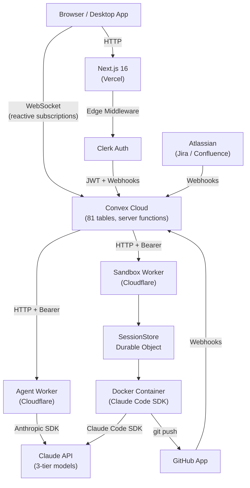

import { Aside, Tabs, TabItem } from '@astrojs/starlight/components';

Foundry is a four-process distributed system. In local development you run all four processes on your machine. In production, each process maps to a managed platform.

## Dual-mode architecture

<Tabs>
  <TabItem label="Production">
    ```
    Vercel (apps/web)
      ├── Edge Middleware (Clerk auth)
      ├── Static/SSR pages + 4 API routes (OAuth callbacks)
      └── Client WebSocket → Convex Cloud

    Convex Cloud
      ├── 81 tables, server functions, AI actions
      └── HTTP calls → Cloudflare Workers

    Cloudflare Workers
      ├── foundry-agent-worker — AI analysis routes (Hono + Anthropic SDK)
      └── migration-sandbox-worker — sandbox execution (Durable Objects + Containers)
    ```
  </TabItem>
  <TabItem label="Local Dev">
    ```
    Browser → Next.js dev server (apps/web, port 3000)
               ↕ WebSocket → Convex dev (convex/)
               ↕ HTTP → Express agent-service (port 3001, Claude Code OAuth)
               ↕ HTTP → Wrangler sandbox-worker (port 8788)
    ```
  </TabItem>
</Tabs>

## Architecture diagram



## The four processes

### 1. Frontend — Next.js 16 (App Router)

The web frontend runs on **Vercel** in production and `localhost:3000` in development. It serves 25+ route surfaces under an authenticated dashboard route group.

Key characteristics:
- **Ultra-thin route pages.** All feature UI lives in `packages/ui/`. Page files are 3-7 line wrappers that import from `@foundry/ui/*`.
- **No data fetching layer.** All data flows through Convex WebSocket subscriptions via `useQuery` hooks. Zero polling, zero REST calls for data.
- **Shared with desktop.** The Tauri desktop app (`apps/desktop`) imports the same `@foundry/ui` components with Next.js API shims.

```typescript
// Typical page file — apps/web/src/app/(dashboard)/[programId]/tasks/page.tsx
"use client";
import { ProgramTasksRoute } from "@foundry/ui/tasks";
export default function ProgramTasksPage() { return <ProgramTasksRoute />; }
```

### 2. Backend — Convex

Convex is the single source of truth for all persistent state. It hosts 81 tables, all server functions, AI orchestration actions, and HTTP webhook handlers.

Key characteristics:
- **Reactive subscriptions.** Every `useQuery` call opens a WebSocket subscription. When underlying data changes, all connected clients update instantly.
- **Transactional mutations.** Mutations have serializable isolation and automatic retry on conflict. Side effects belong in actions, not mutations.
- **Server functions co-located with schema.** Queries, mutations, and actions live alongside `schema.ts` in the `convex/` directory.
- **HTTP endpoints.** Eight webhook routes handle events from Clerk, GitHub, Atlassian, Stripe, and the sandbox worker.

### 3. Agent Worker — Cloudflare Worker (production) / Express (local)

The agent service handles AI inference for structured analysis tasks. It runs as an **Express 5 sidecar** in local development and as a **Cloudflare Worker (Hono)** in production.

**Routing logic** in `convex/lib/agentServiceClient.ts`:
- **Local:** `AGENT_SERVICE_URL=http://localhost:3001` — no bearer auth required
- **Production:** `AGENT_SERVICE_URL=https://foundry-agent-worker.<account>.workers.dev` — bearer auth via `AGENT_SERVICE_SECRET`

The service is stateless by design. It receives a request, calls the Claude API, and returns structured output. No database access.

### 4. Sandbox Worker — Cloudflare Worker + Durable Objects + Docker

The sandbox worker provisions ephemeral AI coding environments scoped to individual tasks. It runs on **Cloudflare** in both environments.

Architecture:
- **Cloudflare Worker** — lightweight request router
- **SessionStore Durable Object** — one per sandbox session, manages Docker container lifecycle
- **Docker Container** — runs Claude Code SDK with full repository access

The 10-stage provisioning pipeline: `containerProvision` -> `systemSetup` -> `authSetup` -> `claudeConfig` -> `gitClone` -> `depsInstall` -> `mcpInstall` -> `workspaceCustomization` -> `healthCheck` -> `ready`.

## Provider wrapping order

The React component tree follows a strict nesting order. Breaking this order causes auth failures.

```
ClerkProvider (Server Component, app/layout.tsx)
  → ConvexProviderWithClerk (Client Component, lib/convex.tsx)
    → ThemeProvider
      → SandboxBackendProvider
        → SandboxHUDProvider
          → SearchProvider
            → DashboardShellLayout (Sidebar + Header + SandboxHUD)
              → ProgramProvider (at [programId] layout level)
```

<Aside type="caution">
Convex must be **inside** Clerk, never the reverse. Convex needs the Clerk JWT to authenticate WebSocket connections. Swapping the order causes silent auth failures.
</Aside>

## Why this stack

### Why Convex over Postgres

Reactive queries, real-time subscriptions, server functions co-located with schema, and a document model that maps cleanly to the delivery domain. The tradeoff is vendor lock-in and the mutation/action boundary (mutations cannot call Node.js APIs). Worth it for velocity and the real-time UX — zero polling infrastructure needed.

### Why Clerk organizations as tenancy

`assertOrgAccess()` on every query and mutation. Row-level security by default. The alternative was building a custom auth layer — exactly the kind of undifferentiated work that kills solo founder projects. Clerk organizations map 1:1 to tenants; `users.orgIds[]` is the tenancy boundary.

### Why Cloudflare for AI workers

Edge proximity, generous free tier for the agent worker (low-volume structured analysis), and Durable Objects + Containers for the sandbox worker. The sandbox system needs per-session state (Durable Objects) and ephemeral compute (Docker containers) — Cloudflare provides both in one platform.

### Why the monorepo UI pattern

All feature UI in `packages/ui/`, not in `apps/web/`. Page files are thin wrappers. This enables the Tauri desktop app to share every component without forking. Add logic to a page file and you break the shared component model.
